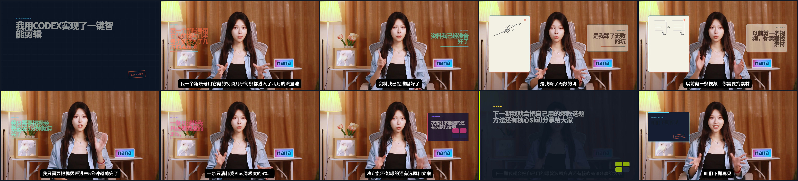

# AI Self-Media Video Packaging Skill

一套可直接调用的 Agent Skill：把人物居中的横屏真人口播视频与 SRT 转成有节奏、有证据边界、可复现的视频包装工程。默认使用 Remotion 生成真实成片，也可以从同一份 storyboard 生成 HyperFrames 项目。

它不是“随便套几个字幕卡”的模板集合。完整流程会先检查源视频、逐条解析 SRT、生成 Gate A 审核稿，获得明确批准后才进入视觉实现和渲染；最后还会检查真实成片，而不是用成功构建或静态页面代替交付证据。

## 真实调用效果

下面所有画面都直接抽取自同一次真实 Skill 调用生成的最终 MP4。案例使用 49.273 秒、1920×1080 的口播源片与 21 条 SRT；Remotion 输出为 49.344 秒、H.264/AAC，输出 SHA-256 为 `30B98D2A68B6204D101DF3752A58C53FFA4641E6BDCE93C1E71C5A2ABF64EB20`。



| 开头钩子 | 事实归属卡 | 程序化简笔画 |
|---|---|---|
|  |  |  |

| 前后对比 | 速度表达 | 结尾行动引导 |
|---|---|---|
|  |  |  |

这组预览不是设计稿。完整证据链包括：[真实调用命令](examples/auto-editing-0/invocation.txt)、[输入哈希与参数](examples/auto-editing-0/input-manifest.json)、[完整分镜](examples/auto-editing-0/storyboard.json)、[逐帧哈希与时间码](examples/auto-editing-0/preview-manifest.json)及[成片验收记录](examples/auto-editing-0/QA_REPORT.md)。原始视频和 SRT 不随仓库分发。

## 你会得到什么

- 一条连续的源视频/音频主轨，不擅自重剪或重排原片。
- 依据 SRT 语义自动规划的视觉节拍，普通片段优先控制在 1.6–3.2 秒，硬上限 6 秒。
- 18 种视觉结构、6 套差异化视觉语法、6 组语义配色、10 种 seek-safe 动效原语、6 类程序化 SVG 简笔画。
- 已烧录字幕、无字幕、生成字幕三种模式，避免重复字幕。
- 证据卡、个人经验、估算和客观事实的边界控制。
- Remotion 默认渲染，以及可选的 HyperFrames 项目生成。
- 输入哈希、媒体探测、storyboard、截图、输出 manifest、完整解码等验收证据。

## 视觉与动画能力

### 18 种视觉结构

`impact-question`、`contrarian-stamp`、`gradient-keyword`、`split-conflict`、`three-beat-hook`、`side-insight-card`、`dual-concept`、`keyword-relay`、`adaptive-steps`、`signal-route`、`state-switch`、`chapter-timeline`、`evidence-pip`、`evidence-takeover`、`metric-counter`、`before-after`、`capability-matrix`、`completion-rail`。

结构选择由口播逻辑、人物安全区和证据状态共同决定，不为了凑变化而随机套用。详见 [视觉结构说明](references/visual-structures.md)。

### 真人居中安全排版

- 人物默认位于画面中间，中央约 35%–65% 保持透明。
- 普通信息进入左侧 6%–32% 或右侧 68%–94%，左右交替出现。
- 底部 18% 预留给原片烧录字幕。
- 开头钩子、章节转场、证据和结尾收束可短暂全屏，普通全屏镜头约 1–2 秒。
- 冲击问题、渐变关键词、信号路径、编辑印章、完成检查轨与纸张简笔画分别使用不同版式和语义配色，不是同一张卡片随机换色。

### 10 种 seek-safe 动效原语

`hit`、`slide`、`lift`、`stamp`、`route`、`trace`、`count`、`reveal`、`relay`、`focus`。

所有动画都由当前帧、fps、起始帧和持续时间计算；相同帧永远得到相同状态，支持任意 seek 和逐帧渲染。

### 6 类程序化简笔画

`information-overload`、`climb-boulder`、`workstation-balance`、`paper-plane-route`、`route-activation`、`before-after-illustration`。

简笔画用于解释信息过载、困难推进、权衡、速度路径、流程激活和前后变化。SVG 线条显式使用 `fill="none"`，不会把解释性插画伪装成事实证据。详见 [动效与简笔画说明](references/motion-and-illustration.md)。

## 安装

环境要求：Node.js 20+、FFmpeg 与 ffprobe 可用。

```bash
git clone https://github.com/zhouyuechuan2025-ui/ai-self-media-video-packaging-skill.git
cd ai-self-media-video-packaging-skill
npm ci
```

作为 Agent Skill 使用时，把整个仓库目录复制或链接到 Agent 的 Skills 目录。入口文件是 [SKILL.md](SKILL.md)，推荐触发语句：

> 使用 package-talking-head-video 检查这段 MP4 和 SRT，先生成 Gate A，未经我批准不要渲染。

## 最短使用流程

### 硬规则：先出方案，确认后再实施

每个视频都必须先执行不渲染的 Gate A，把源文件参数、SRT 节拍、视觉结构、语义配色、左右排版、全屏时机、事实风险、字幕模式和安全区方案交给用户确认。只有当前这个视频收到明确批准，才能进入视觉实现；沉默、催进度、其他视频的批准或笼统授权都不能代替本次确认。

### 1. 只做 Gate A，不渲染

```bash
npm run package-video -- --video ./input.mp4 --srt ./input.srt --out ./run --renderer remotion --captions burned-in
```

会生成 `BRIEF.md`、`SOURCE_PROBE.json`、`STORYBOARD.md`、`storyboard.json` 和 `input-manifest.json`。

### 2. Gate A 获批后生成 Remotion 成片

```bash
npm run package-video -- --video ./input.mp4 --srt ./input.srt --out ./run --renderer remotion --captions burned-in --approve-gate-a --render
```

程序会在 HEVC 等浏览器不兼容输入时创建不改时序的 H.264/AAC 制作代理，生成最终 MP4、代表帧和 `RENDER_MANIFEST.json`，并执行完整解码。

### 3. 生成 HyperFrames 项目

```bash
npm run package-video -- --video ./input.mp4 --srt ./input.srt --out ./run --renderer hyperframes --captions burned-in --approve-gate-a
npx hyperframes@0.7.99 lint ./run/hyperframes
npx hyperframes@0.7.99 check ./run/hyperframes --snapshots
```

Remotion 与 HyperFrames 共享同一份 schema 和 storyboard，避免两套规则互相漂移。更完整的参数与字幕模式见 [使用说明](docs/USAGE.md)，案例见 [案例说明](docs/EXAMPLES.md)，异常处理见 [排障说明](docs/TROUBLESHOOTING.md)。

## 质量门禁

1. **Gate A — 分析与方案：** 探测媒体、计算哈希、解析全部 SRT、检查事实边界、生成分镜；禁止渲染。
2. **Gate B — 视觉实现：** 获批后实现视觉结构、动效和必要插画；不把画廊截图当成结果。
3. **Gate C — 可交互验收：** 检查实际时间轴、任意 seek、人物与字幕安全区、证据可读性。
4. **Gate D — 导出验收：** 获得明确导出授权后渲染，并用 ffprobe、完整解码和代表帧验证最终文件。

## 事实与安全原则

- 不发明百分比、用户评价、平台能力、Logo 或产品成绩。
- 估算和个人实测必须保留归属，不能改写成普遍事实。
- 证据卡必须有真实素材；插画和通用图标不能充当证据。
- 默认保留原片剪辑、声音和已烧录字幕。
- 仓库发布前扫描密钥、本地绝对路径、源媒体、大文件和未完成标记。
- README 截图必须来自同一个可验证的真实成片输出。

## 开发与验证

```bash
npm test
npm run typecheck
npm run build
npm run verify:public
npm audit --omit=dev
```

仓库使用 MIT License。Remotion 另有自身许可与商业使用条款；HyperFrames 可选适配器受其上游许可约束。使用第三方人物、商标、视频、图片与字体前，请自行确认授权。

## 关于作者与下一步

当然，做出好视频并不等于能变现赚钱。

如果你已经跑出第一条小样，下一步不是继续囤 Skill，而是确定你要用它做什么事情。

普通人在AI时代能够干什么赚钱？其实无非就这几个方向：用AI做内容、用AI做产品、用AI做服务。

其中做内容，并且是做自媒体内容，是门槛最低、见效最快、正反馈最快的赛道。我本人以及我身边带的几个学员，都在这个赛道拿到了不错的反馈。

从平台数据来看，这个体感更加明显。无数大大小小的AI品牌方需要找AI博主做推广，但是目前能够持续产出优质AI内容的创作者还很少，供不应求，就是你最好的入手时机——你不是在追赶一个已经饱和的赛道，而是在一个正在快速上升的赛道上占位置。

我们在做的就是现在，就是这样的事情。
针对不同人群的不同需求，我们已设计开发两个课程产品，预计8月14日开售。
不仅会教给你完整的AI自媒体快速起号方法、避坑指南，还能给到独家内部商单派单资源。
感兴趣的朋友欢迎咨询业务微信：nanaya093
