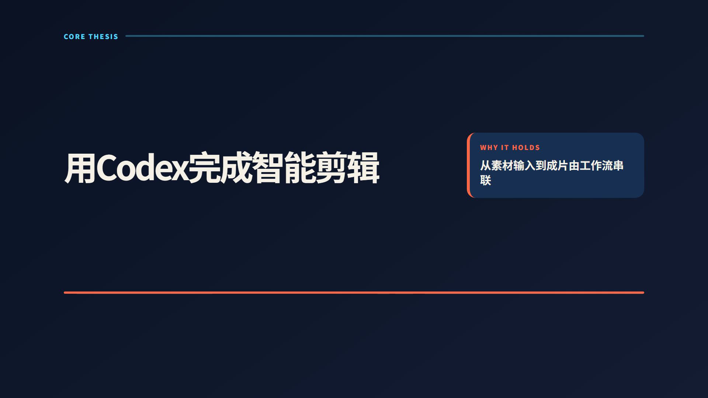
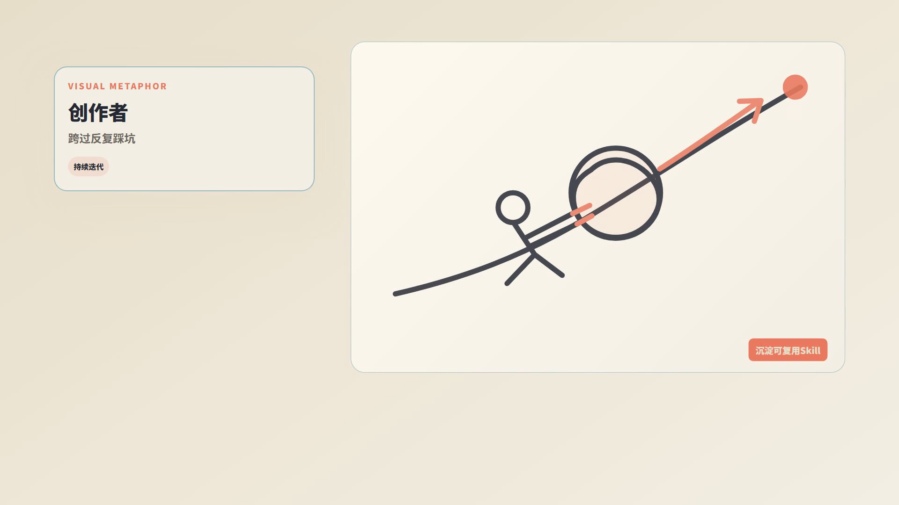
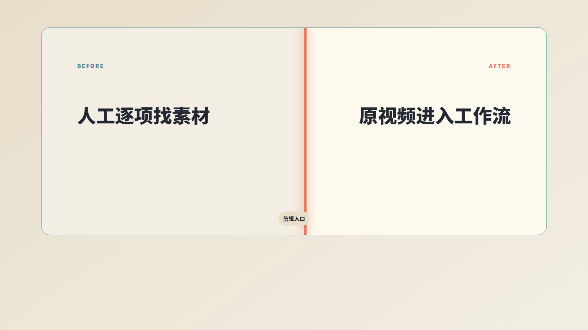
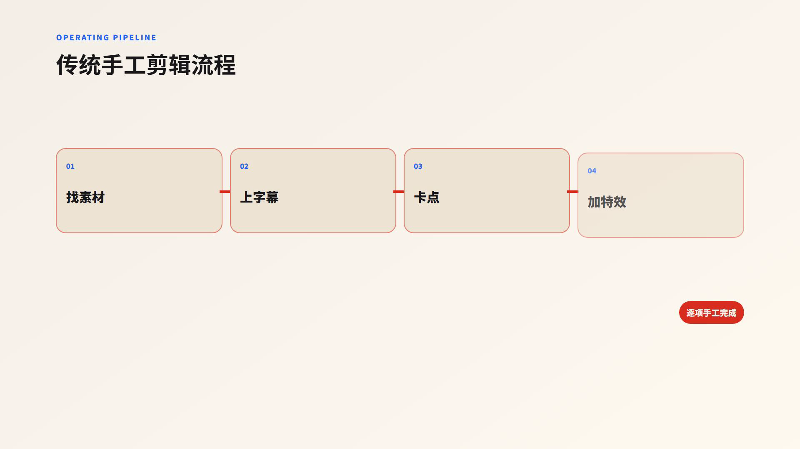
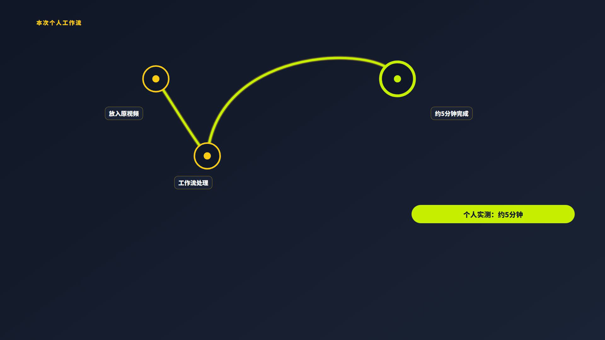

# AI Self-Media Video Packaging Skill

一套可直接调用的 Agent Skill：把人物居中的横屏真人口播视频与 SRT 转成有节奏、有证据边界、可复现的视频包装工程。默认使用 Remotion 生成真实成片，也可以从同一份 storyboard 生成 HyperFrames 项目。

它不是“随便套几个字幕卡”的模板集合。完整流程会先检查源视频、逐条解析 SRT、生成 Gate A 审核稿，获得明确批准后才进入视觉实现和渲染；最后还会检查真实成片，而不是用成功构建或静态页面代替交付证据。

## 真实调用效果

下面所有画面都直接抽取自同一次真实 Skill 调用生成的最终 MP4。案例使用 49.273 秒、1920×1080 的口播源片与 21 条 SRT；导演方案实际生成 22 个视觉节拍，使用 6 套配色与 8 种语义结构，最长状态 3.2 秒。Remotion 输出为 49.323 秒、H.264/AAC，输出 SHA-256 为 `60BE56C417FE63EF17F18874A4EE74318D001CD40D7A40BA3312488900B85443`。


| 论点与证据 | 双侧编辑轨 | 文字指标 |
|---|---|---|
|  |  |  |

| 命令面板 | 语义简笔画 | 前后对比 |
|---|---|---|
|  |  |  |

| 四阶段流程 | 信号路径 |
|---|---|
|  |  |

这组预览不是设计稿。完整证据链包括：[真实调用命令](examples/auto-editing-0/invocation.txt)、[输入哈希与参数](examples/auto-editing-0/input-manifest.json)、[完整分镜](examples/auto-editing-0/storyboard.json)、[逐帧哈希与时间码](examples/auto-editing-0/preview-manifest.json)及[成片验收记录](examples/auto-editing-0/QA_REPORT.md)。原始视频和 SRT 不随仓库分发。

## 你会得到什么

- 依据 SRT 语义自动规划的视觉节拍，普通片段优先控制在 1.6–3.2 秒，硬上限 6 秒。
- 10 种语义视觉结构、6 组语义配色、10 种 seek-safe 动效原语、6 类程序化 SVG 简笔画。
- 三种清晰的字幕模式：原视频已经带有字幕（字幕已固定在画面中）；原视频没有字幕，希望 Skill 自动生成字幕；原视频没有字幕，并且只需要动效、不需要字幕。这样可以避免重复字幕。
- 证据卡、个人经验、估算和客观事实的边界控制。
- Remotion 默认渲染，以及可选的 HyperFrames 项目生成。
- 输入哈希、媒体探测、storyboard、截图、输出 manifest、完整解码等验收证据。

## 视觉与动画能力

### 10 种语义视觉结构

`editorial-dual-rail`、`thesis-and-proof`、`bidirectional-flow`、`command-palette`、`four-stage-pipeline`、`before-after-scrub`、`evidence-panel`、`metric-odometer`、`signal-route`、`semantic-doodle`。

结构选择由口播逻辑、人物安全区和证据状态共同决定，不为了凑变化而随机套用。详见 [视觉结构说明](references/visual-structures.md)。

### 真人居中安全排版

- 人物默认位于画面中间，中央约 35%–65% 保持透明。
- 普通信息进入左侧 6%–32% 或右侧 68%–94%，左右交替出现。
- 底部 18% 预留给原视频中已经固定在画面里的字幕。
- 每个镜头只能二选一：人物安全模式，或100%不透明全屏模式。任何卡片、路径、插画或光效需要进入人物中心区时，必须切换为完整全屏，禁止半透明压脸。
- 左右信息卡按内容自适应高度，不用固定通栏高度填充空白；只有两组真实互补信息才使用双侧卡。
- 开头钩子、章节转场、证据和结尾收束可短暂使用100%不透明全屏，普通全屏镜头约 1–2 秒。
- 冲击问题、渐变关键词、信号路径、编辑印章、完成检查轨与纸张简笔画分别使用不同版式和语义配色，不是同一张卡片随机换色。

### 10 种 seek-safe 动效原语

`hit`、`slide`、`lift`、`stamp`、`route`、`trace`、`count`、`reveal`、`relay`、`focus`。

所有动画都由当前帧、fps、起始帧和持续时间计算；相同帧永远得到相同状态，支持任意 seek 和逐帧渲染。

### 6 类程序化简笔画

`information-overload`、`climb-boulder`、`workstation-balance`、`paper-plane-route`、`route-activation`、`before-after-illustration`。

简笔画用于解释信息过载、困难推进、权衡、速度路径、流程激活和前后变化。SVG 线条显式使用 `fill="none"`，不会把解释性插画伪装成事实证据。详见 [动效与简笔画说明](references/motion-and-illustration.md)。

## 安装

环境要求：Node.js 20+、FFmpeg 与 ffprobe 可用。

```bash
git clone https://github.com/zhouyuechuan2025-ui/ai-self-media-video-packaging-skill.git
cd ai-self-media-video-packaging-skill
npm ci
```

作为 Agent Skill 使用时，把整个仓库目录复制或链接到 Agent 的 Skills 目录。入口文件是 [SKILL.md](SKILL.md)，推荐触发语句：

> 使用 package-talking-head-video 检查这段 MP4 和 SRT，先生成 Gate A，未经我批准不要渲染。

## 前期素材准备

### 1. 先准备剪辑完成的真人口播视频

这个 Skill 负责的是**画面包装**，不处理重读、漏读和气口，也不负责修正口误、长停顿、错误镜头或其他基础剪辑问题。输入视频必须是顺序、声音和时长已经确定的完整成片。

推荐使用人物位于画面中间的 16:9 横屏素材。原视频如果已经带有字幕，而且字幕已经固定在画面中，后续应使用 `--captions burned-in`，避免再生成一层重复字幕。

如果源片没有字幕：希望最终包装包含字幕时改用 `--captions generated`；只要动效、不需要字幕时使用 `--captions none`。

### 2. 导出与成片完全对应的 SRT

在剪辑或字幕工具中完成字幕识别、校对和时间轴对齐，导出视频时同时勾选并导出 UTF-8 编码的 `.srt` 文件。视频如果又发生删改，必须重新导出 SRT；旧时间码不能继续使用。

SRT 是动效导演的核心输入。Skill 会读取全部字幕，根据每段口播的语义、时间码和事实属性匹配侧卡、流程、对比、数字、证据或简笔画结构，而不是简单地把字幕换一种颜色显示。

## 在 Codex 中怎么使用

是的，标准流程就是把**视频 + SRT** 一起提供给 Codex，并明确要求调用 `package-talking-head-video`。可以直接这样说：

> 请调用 package-talking-head-video。输入是 `input.mp4` 和 `input.srt`，人物在画面中间，源视频已经剪辑完成，字幕也已经固定在画面中。先分析全部 SRT 并输出 Gate A 包装方案，确认后再制作。最终使用 composite 模式直接输出包装完成的 MP4。

Codex 不会收到文件后立刻盲目导出。Skill 先生成 Gate A 方案，列出动效时间码、视觉结构、配色、人物与字幕安全区、简笔画和事实风险；方案确认后才进入实现、可视验收和最终导出。

## 两种输出与包装方式

| 方式 | 用户提供 | 最终输出 | 适合谁 |
|---|---|---|---|
| **方案一：透明叠加层** | 至少提供 SRT，并指定画布宽高和帧率 | 无音轨、带 Alpha 通道的 ProRes 4444 `overlay.mov` | 已经固定拍摄机位和工程规格、希望在剪映/Premiere/Final Cut 中自行叠加的人 |
| **方案二：直接合成（默认推荐）** | 同时提供剪辑完成的视频和对应 SRT | 已经叠加动效的 H.264/AAC `packaged.mp4` | 大多数第一次使用者、希望减少操作并进行真实人物/字幕遮挡检查的人 |

### 我的推荐

**保留两种方案让用户选择，但默认推荐方案二。** 原因是视频 + SRT 能让 Skill 根据真实分辨率、帧率、人物位置，以及原视频中已经固定的字幕位置完成可视质检，并直接交付成片，出错环节最少。

方案一更适合进阶工作流。只提供 SRT 时，Skill 无法看到真实人物位置、字幕高度和原片构图，只能按默认的中央人物安全区制作；因此必须额外确认 `--width`、`--height` 和 `--fps`。默认值为 `1920×1080 / 30fps`。如果原片机位不固定，建议仍把视频作为参考输入，或直接选择方案二。

### 方案一：只提供 SRT，输出透明 MOV

先生成方案：

```bash
npm run package-video -- --srt ./input.srt --out ./run-overlay --renderer remotion --captions burned-in --output-mode overlay --width 1920 --height 1080 --fps 30
```

全部 Gate 获批后导出：

```bash
npm run package-video -- --srt ./input.srt --out ./run-overlay --renderer remotion --captions burned-in --output-mode overlay --width 1920 --height 1080 --fps 30 --approve-gate-a --approve-gate-b --approve-gate-c --approve-gate-d --render
```

输出文件为 `run-overlay/renders/overlay.mov`。将它放在原口播视频上方同一起点叠加，不要改变速度、入点、出点或画布尺寸。导出会检查 ProRes 编码、Alpha 像素格式、真实透明度变化、无音轨、完整解码、时长、尺寸、帧率和 SHA-256。

上面的示例假定原视频已经带有字幕，而且字幕已固定在画面中，所以命令使用 `burned-in`。如果原视频没有字幕，并希望透明 MOV 包含可见字幕，把两条命令里的字幕参数改成 `--captions generated`。

### 方案二：视频 + SRT，直接合成 MP4

```bash
npm run package-video -- --video ./input.mp4 --srt ./input.srt --out ./run-composite --renderer remotion --captions burned-in --output-mode composite --approve-gate-a --approve-gate-b --approve-gate-c --approve-gate-d --render
```

输出文件为 `run-composite/renders/packaged.mp4`，里面已经包含原口播画面、原声音和动效包装。

## 最短使用流程

### 硬规则：先出方案，确认后再实施

每个视频都必须先执行不渲染的 Gate A，把源文件参数、SRT 节拍、视觉结构、语义配色、左右排版、全屏时机、事实风险、字幕模式和安全区方案交给用户确认。只有当前这个视频收到明确批准，才能进入视觉实现；沉默、催进度、其他视频的批准或笼统授权都不能代替本次确认。

### 1. 只做 Gate A，不渲染

```bash
npm run package-video -- --video ./input.mp4 --srt ./input.srt --out ./run --renderer remotion --captions burned-in --output-mode composite
```

会生成 `BRIEF.md`、`SOURCE_PROBE.json`、`STORYBOARD.md`、`storyboard.json` 和 `input-manifest.json`。

### 2. Gate A 获批后完成 Gate B 视觉实现

```bash
npm run package-video -- --video ./input.mp4 --srt ./input.srt --out ./run --renderer remotion --captions burned-in --output-mode composite --approve-gate-a --approve-gate-b
```

此阶段生成可复核的视觉实现，不导出最终成片。程序会在 HEVC 等浏览器不兼容输入时创建不改时序的 H.264/AAC 制作代理。

### 3. Gate C 可视验收

```bash
npm run package-video -- --video ./input.mp4 --srt ./input.srt --out ./run --renderer remotion --captions burned-in --output-mode composite --approve-gate-a --approve-gate-b --approve-gate-c
```

检查实际时间轴、人物安全区、字幕安全区、语义准确性、配色与结构差异，再决定是否导出。

### 4. Gate D 获批后生成 Remotion 成片

```bash
npm run package-video -- --video ./input.mp4 --srt ./input.srt --out ./run --renderer remotion --captions burned-in --output-mode composite --approve-gate-a --approve-gate-b --approve-gate-c --approve-gate-d --render
```

程序生成最终 MP4、代表帧和 `RENDER_MANIFEST.json`，并执行 ffprobe、完整解码与黑帧扫描。

### 5. 可选：生成 HyperFrames 项目

```bash
npm run package-video -- --video ./input.mp4 --srt ./input.srt --out ./run --renderer hyperframes --captions burned-in --approve-gate-a --approve-gate-b
npx hyperframes@0.7.99 lint ./run/hyperframes
npx hyperframes@0.7.99 check ./run/hyperframes --snapshots
```

Remotion 与 HyperFrames 共享同一份 schema 和 storyboard，避免两套规则互相漂移。更完整的参数与字幕模式见 [使用说明](docs/USAGE.md)，案例见 [案例说明](docs/EXAMPLES.md)，异常处理见 [排障说明](docs/TROUBLESHOOTING.md)。

## 质量门禁

1. **Gate A — 分析与方案：** 探测媒体、计算哈希、解析全部 SRT、检查事实边界、生成分镜；禁止渲染。
2. **Gate B — 视觉实现：** 获批后实现视觉结构、动效和必要插画；不把画廊截图当成结果。
3. **Gate C — 可交互验收：** 检查实际时间轴、任意 seek、人物与字幕安全区、证据可读性。
4. **Gate D — 导出验收：** 获得明确导出授权后渲染，并用 ffprobe、完整解码和代表帧验证最终文件。

Gate C 的代表帧固定抽取在对应节拍的 72% 稳定位置，并逐张人工检查人物遮挡、卡片空白、内容重叠、可读性、语义匹配和字幕安全区；任何一项失败都禁止进入 Gate D。完整规则见 [视觉质检门禁](references/visual-quality-gates.md)。

## 事实与安全原则

- 不发明百分比、用户评价、平台能力、Logo 或产品成绩。
- 估算和个人实测必须保留归属，不能改写成普遍事实。
- 证据卡必须有真实素材；插画和通用图标不能充当证据。
- 默认保留原片剪辑、声音，以及原视频中已经固定在画面里的字幕。
- 仓库发布前扫描密钥、本地绝对路径、源媒体、大文件和未完成标记。
- README 截图必须来自同一个可验证的真实成片输出。

## 开发与验证

```bash
npm test
npm run typecheck
npm run build
npm run verify:public
npm audit --omit=dev
```

仓库使用 MIT License。Remotion 另有自身许可与商业使用条款；HyperFrames 可选适配器受其上游许可约束。使用第三方人物、商标、视频、图片与字体前，请自行确认授权。

## 关于作者与下一步

当然，做出好视频并不等于能变现赚钱。

如果你已经跑出第一条小样，下一步不是继续囤 Skill，而是确定你要用它做什么事情。

普通人在AI时代能够干什么赚钱？其实无非就这几个方向：用AI做内容、用AI做产品、用AI做服务。

其中做内容，并且是做自媒体内容，是门槛最低、见效最快、正反馈最快的赛道。我本人以及我身边带的几个学员，都在这个赛道拿到了不错的反馈。

从平台数据来看，这个体感更加明显。无数大大小小的AI品牌方需要找AI博主做推广，但是目前能够持续产出优质AI内容的创作者还很少，供不应求，就是你最好的入手时机——你不是在追赶一个已经饱和的赛道，而是在一个正在快速上升的赛道上占位置。

我们在做的就是现在，就是这样的事情。
针对不同人群的不同需求，我们已设计开发两个课程产品，预计8月14日开售。
不仅会教给你完整的AI自媒体快速起号方法、避坑指南，还能给到独家内部商单派单资源。
感兴趣的朋友欢迎咨询业务微信：nanaya093
